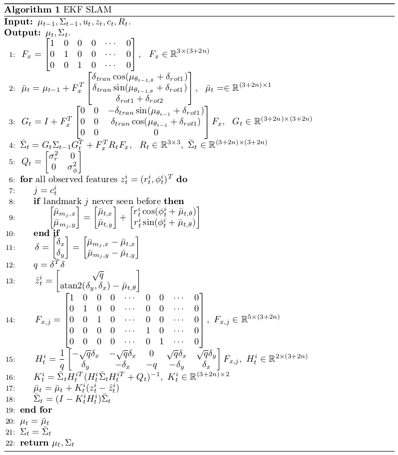

# Extended Kalman Filter for SLAM

The SLAM problem is one of the most fundamental problems in robotics. SLAM problems arise when both map of the environment and the pose of robot are not available. Robots are only given the measurement $$z_{1:t}$$ and controls $$u_{1:t}$$. In SLAM problem, the robot should learn a map of the environment and simultaneously estimate its pose in the environment.

There are two main forms of SLAM problem:

1. Full SLAM problem: robot should computes a posterior over the entire path along with the map, i.e., 
   $$P(x_{1:t}, m|z_{1:t},u_{1:t})$$. 

2. Online SLAM problem: robot computes a posterior over the pose in the current time step along with the map, i.e., 
   $$P(x_t, m|z_{1:t},u_{1:t})$$.

In this project, we implement the EKF SLAM algorithm for the online SLAM problem. The map in this problem is the feature-based map, which is composed of point landmarks. The data set[1] contains the odometry information, the range-bearing sensor readings and the correspondence in each time step. Using EKF, the robot estimates the current pose of robot (illustrated by the red covariance ellipse and bar) and the positions of all landmarks (illustrated by the blue covariance ellipse). The gray lines show the observed landmarks in the current time step.

## EKF Overview

Similar to EKF for localization, the algorithm include two steps: predication by the motion model and correction by the sensor model. Unlike EKF for localization problem, the state includes the position of all landmarks in addition to the robot's pose, i.e.,
$$
(x,y,\theta, m_{1,x}, m_{1,y}, ..., m_{n,x}, m_{n,y})
$$ where $$n$$ is the number of landmarks.

We can obtained the EKF algorithm for SLAM problem below by changing the motion function, observation function and the corresponding Jacobian in EKF for localization.

## Code Explanation

1. `[mu, sigma] = prediction_step(mu, sigma, u)`: Update the belief of the robot's pose based on the motion model. Implement line 1 to 4 in EKF SLAM Algorithm.

2. `[mu, sigma, observedLandmarks] = correction_step(mu, sigma, z, observedLandmarks)`: Updates the belief of the robot's pose and landmark positions according to the sensor model. Implement line 6 to 19 in EKF SLAM Algorithm.

### References

1. **Robot Mapping**  
   University of Freiburg, WS 2013/14, [http://ais.informatik.uni-freiburg.de/teaching/ws13/mapping/](http://ais.informatik.uni-freiburg.de/teaching/ws13/mapping/)

2. **Probabilistic Robotics**  
   S. Thrun, W. Burgard, and D. Fox. MIT Press, Cambridge, Mass., (2005)