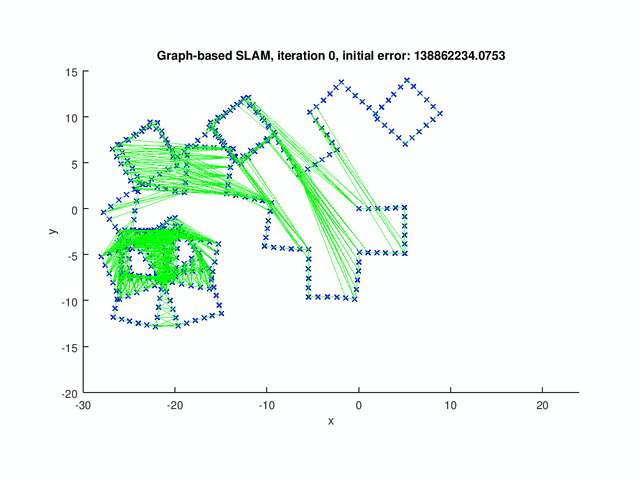
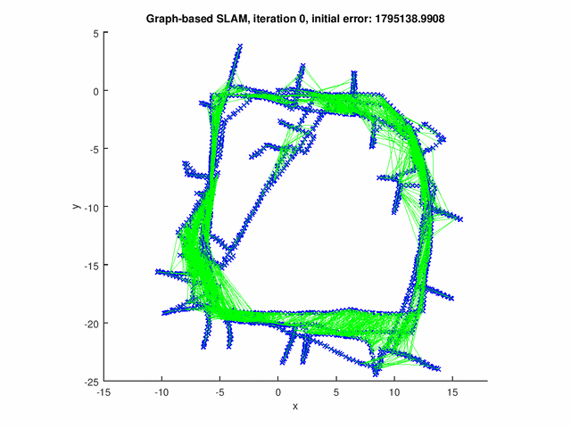
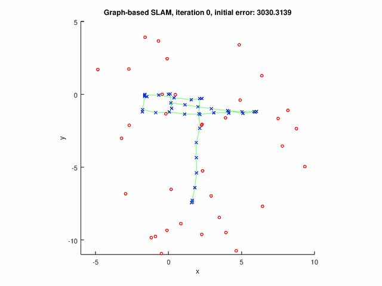
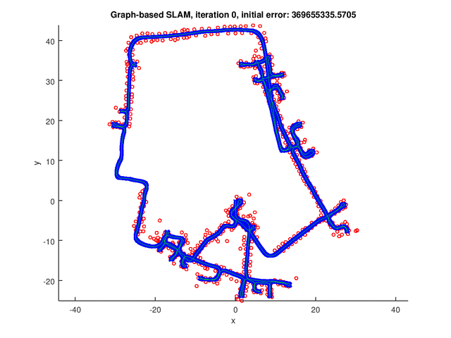

# GraphSLAM

The GraphSLAM is a full SLAM algorithm. It defines a sparse graph in which each node corresponds to a pose of the robot or landmark and each edge corresponds to a spatial constraint between two nodes. The posterior of the full SLAM problem is therefore represented by this graph. There are two components in Graph-based SLAM: (1) Graph construction (front-end); (2) Graph optimization (back-end).

The methods for the front-end problem include dense scan-matching, feature-based matching and descriptor-based matching. In this project, we implement GraphSLAM for solving the back-end problem. More specifically, given the graph structure, we need to compute the node configuration such that the error introduced by the constraints is minimized.

## GraphSLAM Overview

Given the raw data, i.e., measurement and the controls, GraphSLAM first converts the data into a graph. The nodes in the graphs are the robot poses and features in the map. The edge between two nodes indicates the spatial constraint between them. 

More specifically, an edge exists when (1) the robot moves from one node to another; (2) the robot observes a map feasture; (3) the robot observes map feature from two nodes. 

Therefore the error functions are composed of (1) error between robot poses; (2) error between robot pose and landmark pose. The goal of the GraphSLAM is to compute the robot pose and landmark poisition such that the error of constriants is minimized.

We use the Gauss–Newton algorithm to minimize the error. The basic steps of the algorithm is following:

1. Linearize error function around the current poses and compute error for each edge.

2. Construct the linear system.

3. Solve the linear system (which has a sparse structure).

4. Update the poses.

5. repeat procedure until the convergence.

## Code Explanation

1. `Fx = compute_global_error(g)`: compute the error of the current graph `g`.

2.  `[e, A, B] = linearize_pose_pose_constraint(x1, x2, z)`: compute the error `e` and Jacobian `A`, `B` of a pose-pose constraint based on the current robot poses `x1`, `x2` and observation `z`. 

3.  `[e, A, B] = linearize_pose_landmark_constraint(x, l, z)`: compute the error `e` and Jacobian `A`, `B` of a pose-landmark constraint based on the robot pose `x`, landmark position `l` and the observation `z`.

4. `dx = linearize_and_solve(g)`: perform one iteration of Gauss-Newton algorithm, construct and solve the linear approximation. 

## Results

The GraphSLAM algorithm computes solution on four data set[1]. The robot poses are represented by the blue crosses. The landmark positions are represented by the red dots. The edges are the green lines. 

The figure below shows the results for the graph with pose-pose constraints only.

The following figures show the results for graph with both pose-pose constraints and pose-landmark constraints.

### References

1. **Robot Mapping**  
   University of Freiburg, WS 2013/14, [http://ais.informatik.uni-freiburg.de/teaching/ws13/mapping/](http://ais.informatik.uni-freiburg.de/teaching/ws13/mapping/)
