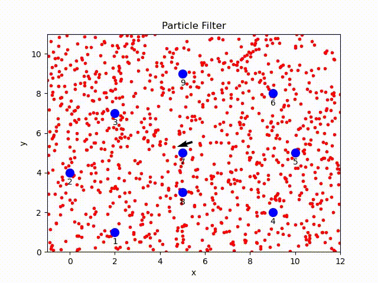
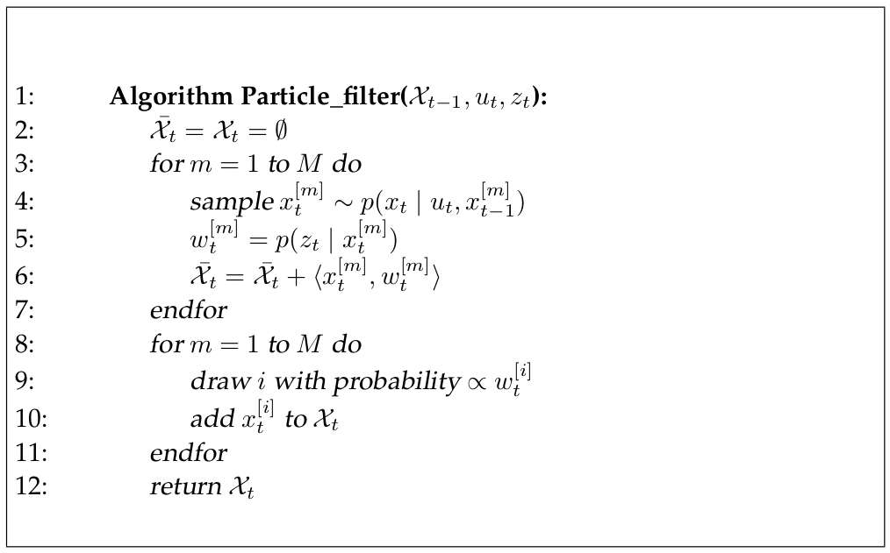
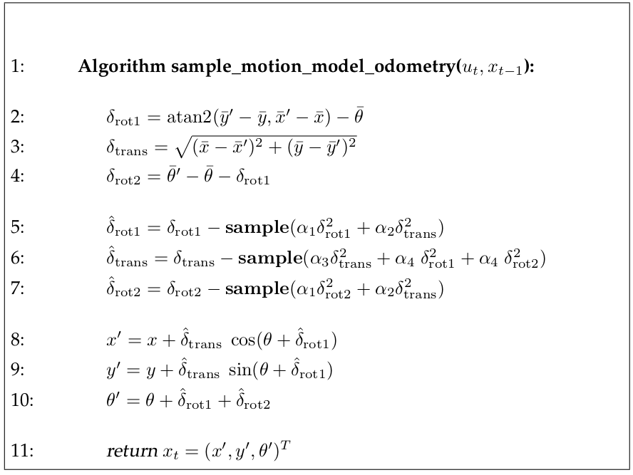
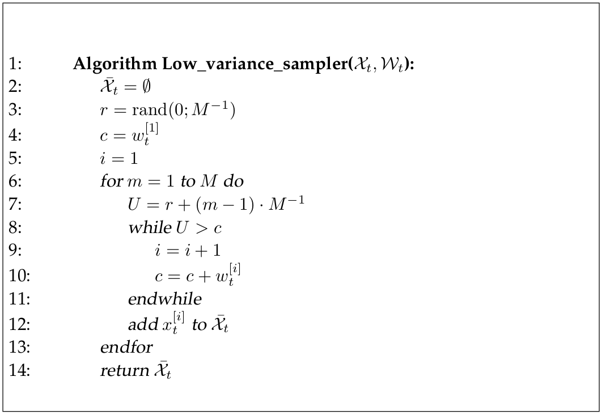

## Particle Filter

Particle filter is a nonparametric filter which represents the posterior by a set of weighted samples. Since the functional form of the posterior is not needed, it can model arbitrary distribution, e.g., non-Gaussian distributions. 

In this project, a complete particle filter is implemented using Python. Given the range-only sensor readings, odometry of robot and the ground-truth position of landmarks, robot uses a set of particles to represent the possible poses and an arrow to represent the average coordinates. 

## Particle Filter Overview

Particle filter is an implementation of recursive Bayesian filter. The posterior $$p(x_t|z_{1:t}, u_{1:t})$$ is represented by a set of weighted samples.

1. In each time step, the particles are propagated based on the motion model 
2. Then they are weighted according to the likelihood of the observation 
   $$P(z_t|x_t)$$.  
3. In the resampling step (importance sampling essentially), new particles are draw with a probability proportional to the weights, which account for the difference between the proposal and target distribution.

<!-- The pseudocode[1] is presented below:

 -->

## Code Explanation

There are three key functions in this implementation.

1. `sample_motion_model(odometry, particles)`: take as inputs the odometry and the current set of particles, sample new particles based on the odometry motion model and the motion noise. 

   <!-- The pseudocode[1] is presented below.

 -->

1. `eval_sensor_model(sensor_data, particles, landmarks)`: given the sensor readings, partcles sampled from motion model, the ground-truth position of landmarks, measurement noise, compute the weights of samples from observation models, i.e., 
   $$w_t = P(z_t|x_t)$$. 

2. `resample_particles(particles, weights)`: draw with replacement $$M$$ (size of particle set) particles from the given set with probability equal to the weight. The resampling is implemented by the low variance resampling with linear complexity.

<!--  -->

### References

1. **Probabilistic Robotics**  
   S. Thrun, W. Burgard, and D. Fox. MIT Press, Cambridge, Mass., (2005)