# Implementation of algorithms in probabilistic robotics

## Particle Filter for localization

## Extended Kalman Filter for localization

## Occupancy grid mapping

Grid size: 0.5 meter\
Code in Octave (Matlab)\
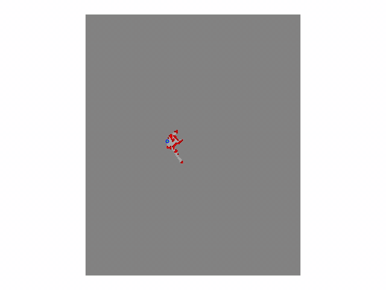

Grid size: 0.1 meter\
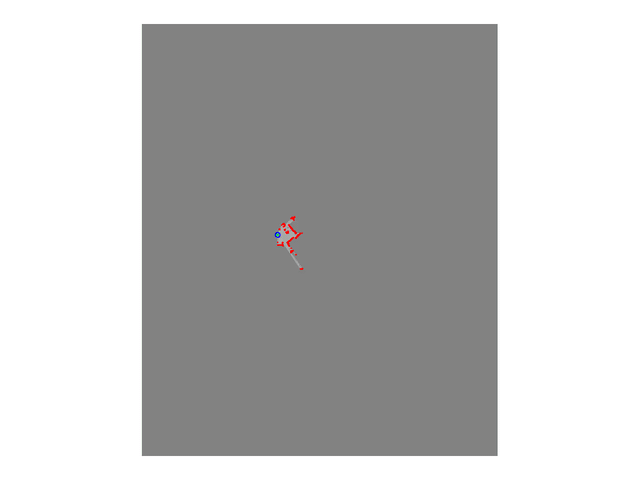

## Extended Kalman Filter SLAM

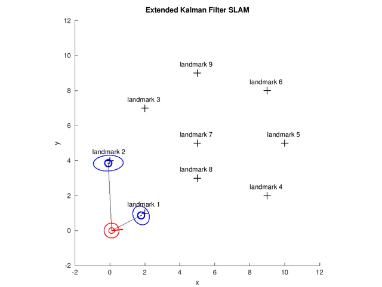

(1) The red dot and bar indicate the pose estimate of the robot.\
(2) The black crosses are the ground truth location of the landmarks.\
(3) The ellipses are the error ellipses of estimated position of robot and landmarks.\
Code in Octave (Matlab).

## Unscented Kalman Filter SLAM

Code in Octave (Matlab).

## FastSLAM

(1) The arrow represent the position and orientation of the particle with the highest weight (which could be different at different time step).\
(2)The red dots represent the position of each particle.\
(3) The red pixels represent the path of the particle with the highest weight.\
(4) The gray pixels represent the path of all particles (some of paths may be disappear because of the resampling step).\
(5) The blue crosses represent the ground-true position of the landmarks.\
(6) The blue dots represent the estimated landmark positions of each particle.\
(7) The ellipse is the error ellipse of estimated landmark positions of the particle with the highest weight.

## Path planning

**Goal: compute path with minimum path cost**\
**Dijkstra's algorithm**\
Cells expanded : 605\
Path cost      : 36.948820168213054\
Path length    : 36.38477631085024\
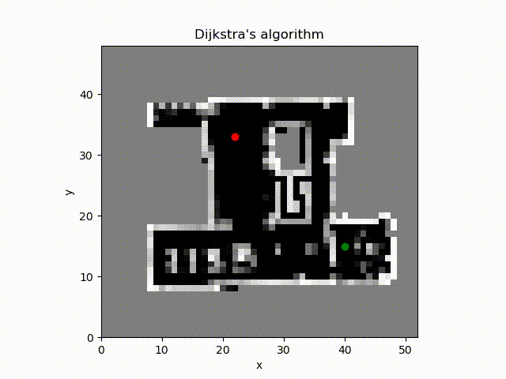

Cost map (the path cost from source to the cell)\
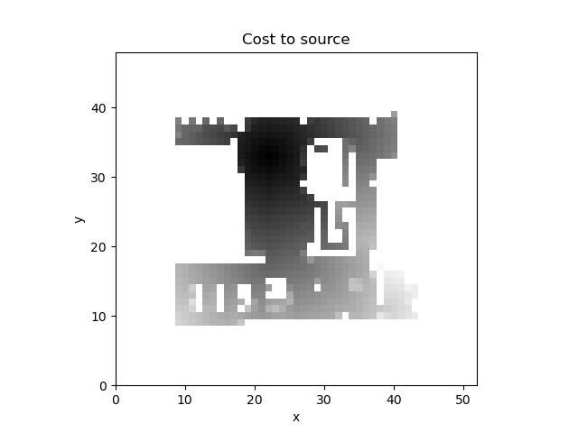

**A\* search**\
Cells expanded : 391\
Path cost      : 36.948820168213054\
Path length    : 36.384776310850235\
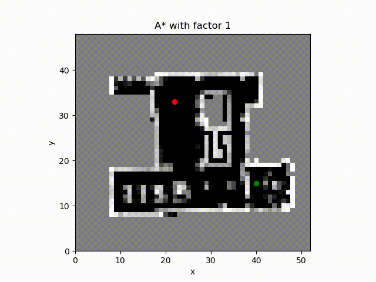

Cost map\
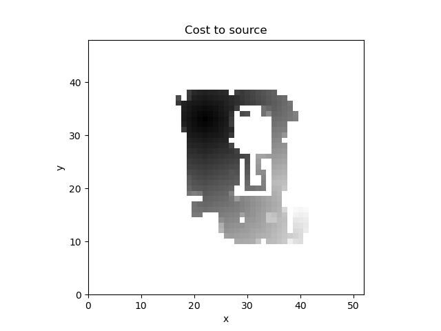

**A\* search with factor equal to 2 (inflating the estimate of the cost to the goal from the cell)**\
Cells expanded : 91\
Path cost      : 38.24887217029314\
Path length    : 35.79898987322333\
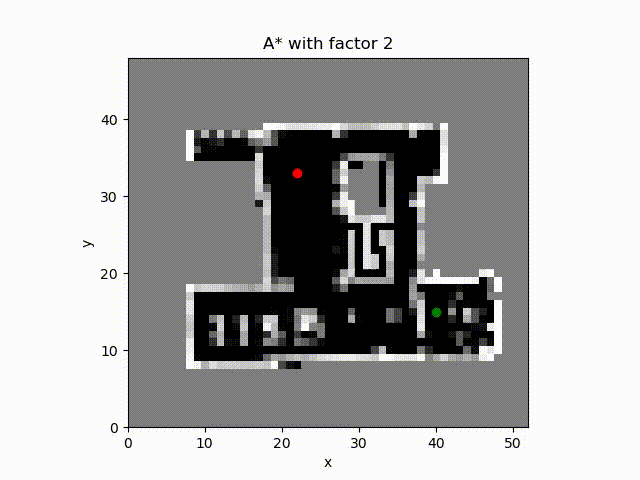

Cost map\
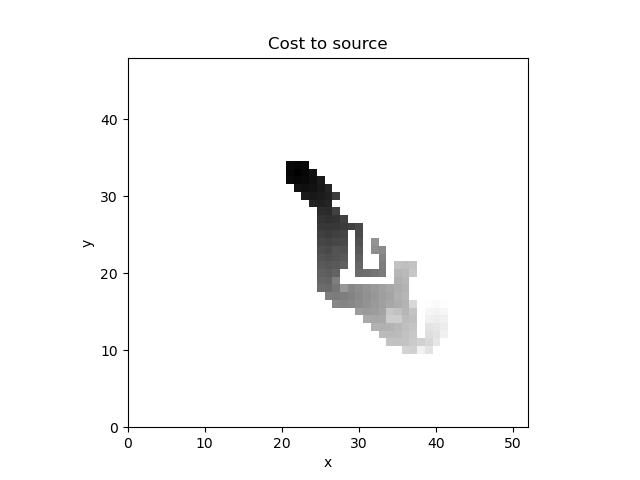

**A\* search with factor equal to 5**\
Cells expanded : 55\
Path cost      : 51.380793533213904\
Path length    : 32.38477631085024\
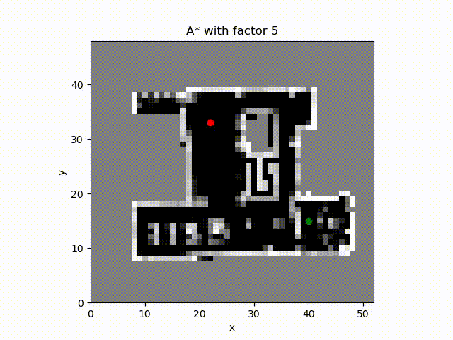

Cost map\
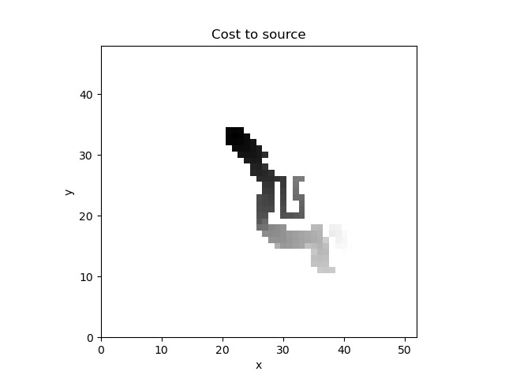

**A\* search with factor equal to 10**\
Cells expanded : 39\
Path cost      : 57.33219203765201\
Path length    : 42.28427124746189\
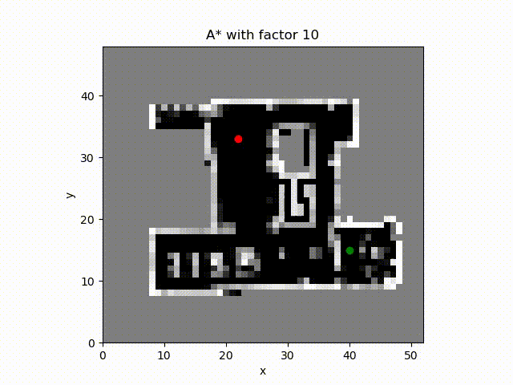

Cost map\
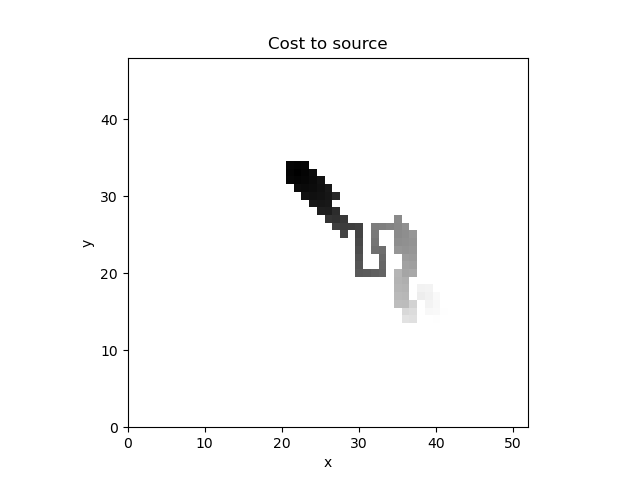

## ICP

(1) The black dots X are in the reference reference point set.\
(2) The blue dots P0 are the points to be matched with the reference.\
(3) The red dots P are the point set after the rotation and translation in each iteration.\
(4) The lines between X and P indicate the matches.\

## Odometry Calibration using least squares method

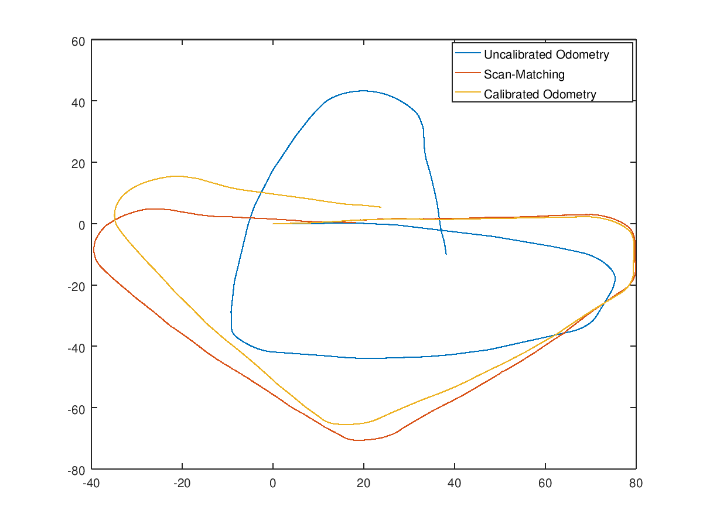

The red line is the ground truth trajectory while the orange line is the trajectory after the calibration.
