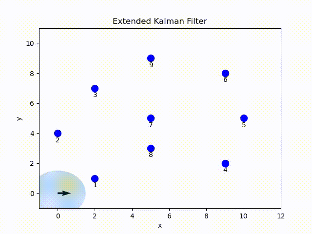
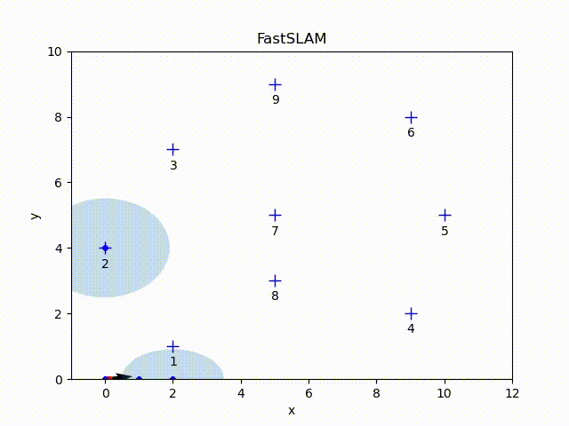
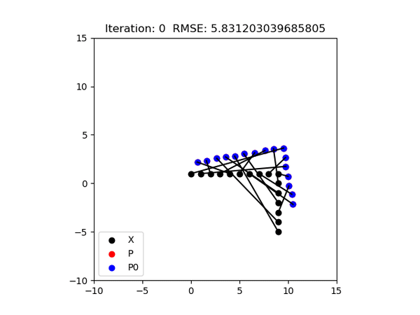
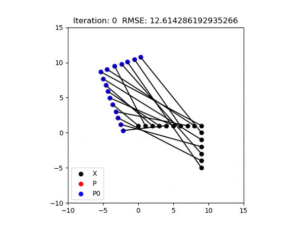

# Implementation of algorithms in probabilistic robotics

## Particle Filter for localization

## Extended Kalman Filter for localization

## FastSLAM

(1) The arrow represent the position and orientation of the particle with the highest weight (which could be different at different time step).\
(2)The red dots represent the position of each particle.\
(3) The red pixels represent the path of the particle with the highest weight.\
(4) The gray pixels represent the path of all particles (some of paths may be disappear because of the resampling step).\
(5) The blue crosses represent the ground-true position of the landmarks.\
(6) The blue dots represent the estimated landmark positions of each particle.\
(7) The ellipse is the error ellipse of estimated landmark positions of the particle with the highest weight.

## ICP

(1) The black dots are in the reference reference point set.\
(2) The blue dots are the points to be matched with the reference.\
(3) The lines between dots indicate the matches.\
